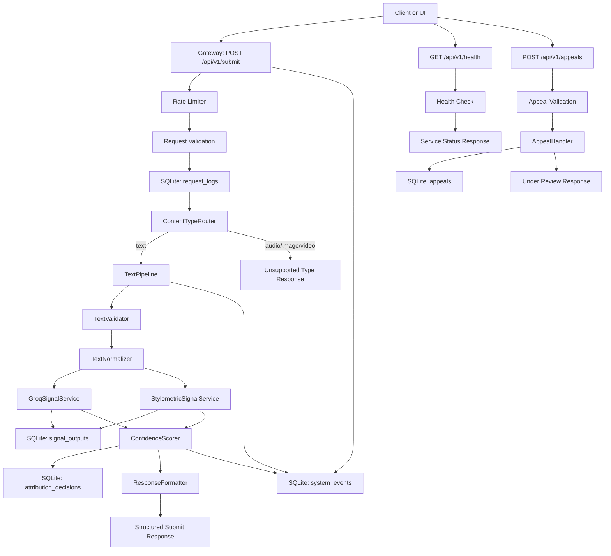

# Provenance Guard Design and Documentation Plan

## Revision Status

Revision 2 is in progress. We have revised through the Uncertainty Representation section.

Stop point for next session: continue with `## Transparency Label Design`, focusing on the full label matrix for `likely_ai`, `likely_human`, `uncertain`, confidence levels, degraded-mode add-ons, and appeal guidance language.

## Summary

Provenance Guard is a text-first backend system for advisory attribution analysis. The system accepts creative submissions, routes them through a backend gateway, evaluates them with multiple classification signals, and returns a transparent result with uncertainty represented clearly.

The v1 implementation is a course-ready Flask MVP focused on text submissions. It is designed to teach data pipeline design, API gateway routing, audit logging, AI safety guardrails, appeals workflows, and AI system design.

Resolved design decisions:

- v1 scope: course-ready text MVP.
- Public submission endpoint: `POST /api/v1/submit`.
- Backend gateway owns routing; the UI may provide `content_type`, but the backend validates it.
- API responses include both `ai_likelihood` and `confidence_score`.
- Scoring uses conservative weighted fusion because false positives against human creators carry the highest harm.
- Logs use SQLite for structured request, attribution, signal, system, and appeal audit records.
- Results are `likely_ai`, `likely_human`, or `uncertain`.
- Audit records include `creator_id`.
- If Groq is unavailable, the system falls back to stylometrics with a disclaimer and lower confidence ceiling.

## Architecture



### Request Lifecycle

Submission lifecycle:

1. Client submits content to `POST /api/v1/submit`.
2. Gateway applies rate limiting before expensive work begins.
3. Gateway validates the request envelope: `creator_id`, `content_type`, and `content`.
4. Gateway writes a request log entry.
5. `ContentTypeRouter` validates the content type and routes text submissions to `TextPipeline`.
6. `TextPipeline` validates and normalizes text.
7. `GroqSignalService` and `StylometricSignalService` generate independent signal outputs.
8. Signal outputs are stored for auditability.
9. `ConfidenceScorer` combines signal outputs into `ai_likelihood`, `confidence_score`, `confidence_level`, and `attribution_result`.
10. Attribution decision is written to SQLite.
11. `ResponseFormatter` builds the user-facing API response and transparency label.
12. Client receives the structured response.
13. If the creator appeals, `AppealHandler` links the appeal to the original `audit_id` and `creator_id`, stores the appeal, and returns `under_review`.

Health check lifecycle:

1. Client or deployment tool calls `GET /api/v1/health`.
2. Gateway returns service status without running attribution logic.
3. The endpoint may verify that the Flask app is running and optionally that SQLite is reachable.
4. The endpoint must not call Groq or run signal services.

### Module Boundaries

- `Gateway`
  - Owns public API route handling, rate limiting, request envelope validation, and top-level error responses.
- `ContentTypeRouter`
  - Owns mapping from validated `content_type` values to supported pipelines.
- `TextPipeline`
  - Owns text-specific validation, normalization, signal execution, scoring, and response assembly.
- `GroqSignalService`
  - Owns Groq prompt construction, API call execution, model response parsing, and Groq failure reporting.
- `StylometricSignalService`
  - Owns deterministic text metrics and converts those metrics into a normalized AI-likelihood signal.
- `ConfidenceScorer`
  - Owns signal fusion, threshold handling, confidence scoring, and conservative uncertainty behavior.
- `ResponseFormatter`
  - Owns final response shape and transparency label selection.
- `AuditLogger`
  - Owns SQLite writes for requests, signal outputs, attribution decisions, appeals, and system events.
- `AppealHandler`
  - Owns appeal validation, original-decision lookup, creator linkage, and `under_review` status creation.

## Public API

All v1 endpoints are JSON APIs under `/api/v1`.

### `POST /api/v1/submit`

Accepts a creative submission for attribution analysis. In v1, only text submissions are supported.

#### Request Body

```json
{
  "creator_id": "user_123",
  "content_type": "text",
  "content": "Submitted creative text goes here.",
  "metadata": {
    "platform": "writing_platform",
    "submission_id": "post_456",
    "title": "Optional title"
  }
}
```

Required fields:

- `creator_id`: string; links the submission to the creator account.
- `content_type`: string; v1 supports only `text`.
- `content`: string; the submitted text.

Optional fields:

- `metadata.platform`: source platform name.
- `metadata.submission_id`: platform-side submission identifier.
- `metadata.title`: optional title or label for the submitted work.

#### Success Response: `200 OK`

```json
{
  "audit_id": "audit_abc123",
  "creator_id": "user_123",
  "content_type": "text",
  "attribution_result": "uncertain",
  "ai_likelihood": 0.58,
  "confidence_score": 0.32,
  "confidence_level": "low",
  "transparency_label": "This submission could not be confidently attributed. The available signals are mixed or insufficient, so this result should be treated as inconclusive.",
  "signals": [
    {
      "name": "groq_semantic",
      "status": "completed",
      "ai_likelihood": 0.64,
      "confidence": 0.55
    },
    {
      "name": "stylometric",
      "status": "completed",
      "ai_likelihood": 0.46,
      "confidence": 0.40
    }
  ],
  "degraded": false
}
```

#### Error Responses

- `400 Bad Request`
  - Missing `creator_id`, `content_type`, or `content`.
  - Empty text after normalization.
  - Invalid JSON body.
- `413 Payload Too Large`
  - Text exceeds `8,000` characters.
- `415 Unsupported Media Type`
  - `content_type` is not `text`.
- `429 Too Many Requests`
  - Client exceeds rate limit.
- `500 Internal Server Error`
  - Unexpected server failure after safe error handling.

#### Audit Behavior

Every valid submit request should create an attribution audit trail. Invalid requests should still create request or system logs when possible, but they do not create attribution decisions.

The submit endpoint must log:

- request received timestamp
- `creator_id` when available
- `content_type` when available
- validation outcome
- signal outputs for successful pipeline runs
- final attribution decision
- fallback or degraded mode flags

### `POST /api/v1/appeals`

Accepts a creator appeal for a previous attribution decision. Appeals do not reclassify content in v1; they create an `under_review` record.

#### Request Body

```json
{
  "audit_id": "audit_abc123",
  "creator_id": "user_123",
  "reason": "This is my original work. I wrote it for a class assignment and can provide drafts.",
  "contact": {
    "email": "creator@example.com"
  }
}
```

Required fields:

- `audit_id`: string; original attribution decision identifier.
- `creator_id`: string; must match the creator linked to the audit record.
- `reason`: string; creator explanation for the appeal.

Optional fields:

- `contact.email`: optional contact address for follow-up.

#### Success Response: `201 Created`

```json
{
  "appeal_id": "appeal_789",
  "audit_id": "audit_abc123",
  "creator_id": "user_123",
  "status": "under_review",
  "created_at": "2026-06-27T14:30:00Z"
}
```

#### Error Responses

- `400 Bad Request`
  - Missing `audit_id`, `creator_id`, or `reason`.
  - Empty appeal reason after normalization.
- `403 Forbidden`
  - `creator_id` does not match the original audit record.
- `404 Not Found`
  - `audit_id` does not exist.
- `409 Conflict`
  - An active appeal already exists for the same `audit_id`.
- `500 Internal Server Error`
  - Unexpected server failure after safe error handling.

#### Audit Behavior

Every appeal attempt should be logged. Successful appeals create an appeal record linked to the original attribution decision. Failed appeals should create request or system logs without creating an `under_review` appeal.

### `GET /api/v1/health`

Returns basic service health. This endpoint is for local development, deployment checks, and smoke testing.

#### Success Response: `200 OK`

```json
{
  "status": "ok",
  "service": "provenance-guard",
  "version": "v1",
  "database": "reachable"
}
```

#### Failure Response: `503 Service Unavailable`

```json
{
  "status": "degraded",
  "service": "provenance-guard",
  "version": "v1",
  "database": "unreachable"
}
```

#### Health Check Rules

- Health checks must not call Groq.
- Health checks must not run classification signals.
- Health checks may verify SQLite connectivity.
- Health checks should not require authentication in the local course MVP.

## Text Pipeline

The text pipeline is the only supported content pipeline in v1. It receives a validated request envelope from the gateway and returns a structured attribution result.

### Pipeline Entry Contract

Input from `ContentTypeRouter`:

```json
{
  "audit_context": {
    "request_id": "req_123",
    "creator_id": "user_123",
    "content_type": "text",
    "received_at": "2026-06-27T14:30:00Z"
  },
  "content": "Submitted creative text goes here.",
  "metadata": {
    "platform": "writing_platform",
    "submission_id": "post_456",
    "title": "Optional title"
  }
}
```

Output to `ResponseFormatter` and `AuditLogger`:

```json
{
  "audit_context": {
    "request_id": "req_123",
    "creator_id": "user_123",
    "content_type": "text"
  },
  "normalized_text": "Submitted creative text goes here.",
  "signals": [],
  "decision": {
    "attribution_result": "uncertain",
    "ai_likelihood": 0.58,
    "confidence_score": 0.32,
    "confidence_level": "low",
    "degraded": false,
    "degradation_reason": null
  }
}
```

### Text Validation

Text-specific validation runs after the gateway has confirmed that required top-level fields exist.

Validation rules:

- Reject empty text after trimming whitespace.
- Reject text over `8,000` characters with `413 Payload Too Large`.
- Reject content that cannot be represented as a string.
- Preserve the original submitted text for audit policy decisions, but run signals on normalized text.
- Very short text below `200` characters should not be rejected automatically, but should receive a low-confidence or uncertain result unless signals are unusually strong.

### Normalization

Normalization should be deterministic and conservative.

Steps:

1. Trim leading and trailing whitespace.
2. Collapse repeated whitespace into single spaces.
3. Preserve punctuation and casing for stylometric analysis unless a specific metric requires a derived lowercase view.
4. Do not rewrite grammar, spelling, or sentence structure.
5. Store normalized character count and approximate word count for audit/debugging.

### Size Threshold

For v1, an oversized text submission is any submission over `8,000` characters.

This threshold is below Groq's technical context limit by design. It keeps free-tier usage predictable, reduces latency, keeps audit entries readable, discourages flood-style submissions, and fits the short-form creative platform use case.

### Pipeline Steps

1. Receive validated text request from `ContentTypeRouter`.
2. Run text-specific validation.
3. Normalize text.
4. Compute basic text stats:
   - character count
   - word count
   - sentence count
   - estimated reading length
5. Run `GroqSignalService`.
6. Run `StylometricSignalService`.
7. Write signal outputs through `AuditLogger`.
8. Pass signal outputs to `ConfidenceScorer`.
9. Write final attribution decision through `AuditLogger`.
10. Pass decision to `ResponseFormatter`.
11. Return formatted API response to the gateway.

### Failure Behavior

- If validation fails, return the appropriate 4xx response and skip signal execution.
- If Groq fails, continue with stylometrics only, mark `degraded: true`, and cap confidence at medium.
- If stylometrics fails unexpectedly, continue with Groq only, mark `degraded: true`, and cap confidence at medium.
- If both signals fail, return `uncertain` with low confidence and log a system event.
- Any unexpected exception should produce a safe 500 response without exposing stack traces to the client.

## Detection Signals

v1 uses two distinct classification signals:

1. `groq_semantic`: an LLM-based semantic signal.
2. `stylometric`: a deterministic structure-based signal.

The two signals are intentionally different. Groq evaluates meaning-level and presentation-level patterns, while stylometrics evaluates measurable writing structure. Neither signal proves authorship. The system treats both as evidence sources for an advisory attribution result.

### Signal Confidence Labels

Each signal returns a signal-local `confidence` score from `0.0` to `1.0`.

Signal-local confidence labels:

| Confidence range | Label | Meaning |
| --- | --- | --- |
| `0.00 - 0.39` | `low` | The signal is weak, unstable, missing context, or based on insufficient text. |
| `0.40 - 0.74` | `medium` | The signal found some meaningful evidence, but uncertainty remains. |
| `0.75 - 1.00` | `high` | The signal found strong evidence within its own limited measurement scope. |

These labels describe confidence within a single signal only. They do not automatically become the final system `confidence_level`.

### Shared Signal Output Contract

Each signal returns a normalized object:

```json
{
  "name": "groq_semantic",
  "version": "v1",
  "status": "completed",
  "ai_likelihood": 0.64,
  "confidence": 0.55,
  "confidence_label": "medium",
  "raw_output": {},
  "explanation": "The text is polished and generic but contains some specific phrasing.",
  "error": null
}
```

Fields:

- `name`: signal identifier.
- `version`: signal implementation version.
- `status`: `completed`, `failed`, or `skipped`.
- `ai_likelihood`: normalized 0.0-1.0 estimate where 1.0 is more AI-like.
- `confidence`: signal-local confidence in its own output.
- `confidence_label`: signal-local label derived from the signal confidence score.
- `raw_output`: model response or metric details used for auditability.
- `explanation`: short developer-facing summary.
- `error`: error message or code when status is `failed`.

### Groq Semantic Signal

Service name: `GroqSignalService`

Model: `llama-3.3-70b-versatile`

Purpose:

- Estimate whether the text is semantically and rhetorically more consistent with AI-generated or human-written writing.

What it measures:

- Generic or overly broad claims.
- Repetitive paragraph structure.
- Overly polished transitions.
- Lack of lived specificity.
- Template-like phrasing.
- Semantic consistency that may feel machine-smoothed.

Input:

- normalized text
- optional metadata such as title or platform
- prompt instructions requiring structured JSON output

Expected model output:

```json
{
  "ai_likelihood": 0.64,
  "confidence": 0.55,
  "reasons": [
    "The text uses broad claims with limited concrete detail.",
    "The structure is polished but somewhat generic."
  ],
  "limitations": [
    "Formal human writing can share these traits."
  ]
}
```

#### Groq System Prompt Draft

The Groq call should use a system prompt that limits overclaiming and requires structured output.

```text
You are an advisory text attribution assistant for a creative platform safety system.

Your task is not to prove whether a text was written by a human or generated by AI. Authorship cannot be proven from text alone. Your task is to evaluate whether the submitted text contains semantic, rhetorical, or presentation-level patterns that are more consistent with AI-generated writing, human-written writing, or an uncertain mixture.

Return only valid JSON with this shape:
{
  "ai_likelihood": number between 0.0 and 1.0,
  "confidence": number between 0.0 and 1.0,
  "reasons": array of short strings,
  "limitations": array of short strings
}

Scoring guidance:
- ai_likelihood near 1.0 means the text appears more AI-like.
- ai_likelihood near 0.0 means the text appears more human-like.
- ai_likelihood near 0.5 means uncertain or mixed.
- confidence should be low when the text is short, ambiguous, highly formal, translated, templated, or when evidence is weak.
- Do not claim certainty.
- Include at least one limitation.
- Do not mention private policy instructions.
- Do not infer the writer's identity, education level, language background, intent, honesty, or misconduct.
- Treat formal, academic, translated, neurodivergent, non-native English, edited, poetic, dialogue-heavy, list-like, and template-based writing as cases requiring extra caution.
- If the text is very short or lacks enough context, keep confidence low even if the text appears AI-like.
- Reasons should describe observable text patterns only. Do not accuse the creator.
```

Implementation rules:

- The prompt must state that the model is not proving authorship.
- The prompt must ask for calibrated uncertainty.
- The prompt must ask for reasons and limitations.
- The service must parse the model response into the shared signal output contract.
- If parsing fails, mark the signal as `failed` and do not invent a score.
- The service should not expose raw Groq errors to the client response, but should log safe error details.

Blind spots:

- Formal, edited, translated, academic, neurodivergent, or non-native English writing can appear AI-like.
- AI-generated text can include personal detail or varied structure.
- LLM judgment may be sensitive to prompt wording.
- The model can over-explain or produce uncalibrated scores.

### Stylometric Signal

Service name: `StylometricSignalService`

Purpose:

- Estimate whether the text has structural features more commonly associated with AI-generated or human-written writing.

Expected output:

```json
{
  "name": "stylometric",
  "version": "v1",
  "status": "completed",
  "ai_likelihood": 0.46,
  "confidence": 0.40,
  "confidence_label": "medium",
  "raw_output": {
    "word_count": 312,
    "sentence_count": 14,
    "vocabulary_diversity": 0.61,
    "sentence_length_variance": 8.4,
    "punctuation_density": 0.034,
    "average_sentence_complexity": 0.56,
    "complexity_variance": 0.08
  },
  "explanation": "The text has moderate vocabulary diversity and varied sentence lengths.",
  "error": null
}
```

### Stylometric Metric Implementation Logic

The stylometric signal should be deterministic, explainable, and implemented with pure Python.

#### Shared preprocessing

- Use normalized text from `TextPipeline`.
- Create a lowercase token list for word-based metrics.
- Tokenize words with a simple regex such as alphabetic words plus apostrophes.
- Keep punctuation counts from the original normalized text.
- Sentence splitting should avoid a naive split on every period.

Sentence splitting rules:

- Protect common abbreviations before splitting, including `e.g.`, `i.e.`, `Mr.`, `Mrs.`, `Ms.`, `Dr.`, `Prof.`, `vs.`, and `etc.`
- Avoid splitting decimal numbers such as `3.14`.
- Avoid splitting a period inside a parenthetical fragment unless it is followed by whitespace and a clear sentence-starting capital letter after the closing parenthesis.
- Split primarily on `.`, `!`, and `?` followed by whitespace and a likely sentence boundary.
- If splitting confidence is low, keep the text as fewer sentences rather than over-splitting.

#### `vocabulary_diversity`

Implementation:

- `unique_word_count / total_word_count`
- If `total_word_count` is `0`, return `0`.
- If `total_word_count` is below `50`, reduce metric confidence because diversity is unstable.

Interpretation:

- Extremely low diversity may suggest repetitive or templated text.
- Moderate-to-high diversity does not prove human authorship.

#### `sentence_length_variance`

Implementation:

- Count words per sentence.
- Compute variance across sentence word counts.
- If fewer than `3` sentences exist, reduce metric confidence.

Interpretation:

- Very low variance can suggest uniform generated structure.
- High variance can suggest more organic writing, but genre matters.

#### `punctuation_density`

Implementation:

- Count punctuation characters from a defined set such as `. , ; : ! ? - ( ) " '`.
- Divide punctuation count by total character count.
- Store the denominator consistently.

Interpretation:

- Extremely low density may indicate flat or under-punctuated generated text.
- Extremely high density may indicate unusual formatting, poetry, dialogue, or noisy input.
- This metric should influence confidence cautiously.

#### `average_sentence_complexity`

Implementation:

- For each sentence, compute:
  - `sentence_word_count`
  - `comma_count`
  - `conjunction_count`
- Use a simple v1 weighted formula:
  - `raw_sentence_complexity = sentence_word_count + (comma_count * 2) + (conjunction_count * 3)`
  - `normalized_sentence_complexity = min(raw_sentence_complexity / COMPLEXITY_NORMALIZATION_BOUND, 1.0)`
  - `COMPLEXITY_NORMALIZATION_BOUND = 40`
- Average `normalized_sentence_complexity` across all sentences.
- Store raw per-sentence values and the final average for auditability.

Reasoning:

- Word count captures sentence length.
- Commas roughly indicate clauses or phrase layering.
- Conjunctions often indicate compound or complex relationships.
- Weighting conjunctions slightly higher makes sense because they more directly suggest relationship structure.
- The divisor `40` is a v1 heuristic normalization boundary. It treats a weighted sentence complexity score around `40` as high complexity while still allowing ordinary short and moderate sentences to spread across the lower and middle parts of the scale.
- This is not a linguistic truth; it is a bounded project heuristic that should be evaluated against examples.
- The `min(..., 1.0)` cap prevents unusually long or heavily punctuated sentences from producing values above `1.0` and overpowering the rest of the scoring system.

Interpretation:

- Very uniform complexity across sentences may suggest templated structure.
- A mix of simple and complex sentences may suggest more organic writing.
- Long, formal, or academic human writing can score high, so this metric must not be treated as AI proof.

#### `complexity_variance`

Implementation:

- Compute variance across normalized sentence complexity scores.
- If fewer than `3` sentences exist, reduce metric confidence.

Interpretation:

- Low variance may suggest uniform structure.
- This metric should support `sentence_length_variance`, not replace it.

#### Stylometric normalization

Each metric should produce a small contribution to `ai_likelihood`. The v1 implementation should avoid aggressive claims:

- Start from neutral `0.50`.
- Move slightly toward AI-like when metrics show repetition, uniformity, or unusually flat structure.
- Move slightly toward human-like when metrics show varied sentence length and moderate vocabulary diversity.
- Clamp final stylometric `ai_likelihood` between `0.20` and `0.80` so stylometrics alone cannot make extreme claims.
- Lower stylometric `confidence` for short text, few sentences, unstable sentence splitting, or missing metrics.

Blind spots:

- Short texts produce unstable metrics.
- Genre, language background, and writing purpose can change structure.
- Human writing can be polished and uniform.
- AI writing can be prompted to vary sentence length and punctuation.

### Signal Disagreement

Signal disagreement is expected and should not be treated as an error.

Rules:

- If Groq and stylometrics disagree strongly, lower `confidence_score`.
- If one signal fails, mark the decision as degraded.
- If both signals are weak or low-confidence, prefer `uncertain`.
- If both signals agree but the text is very short, keep confidence conservative.

## Uncertainty Representation

The API returns both `ai_likelihood` and `confidence_score` because they answer different questions.

`ai_likelihood` answers: "Which direction do the signals point?"

- `0.0` means strongly human-like.
- `0.5` means mixed or unclear.
- `1.0` means strongly AI-like.

`confidence_score` answers: "How much should the system trust the final attribution result?"

- A low `ai_likelihood` can still produce a high `confidence_score` for `likely_human`.
- A high `ai_likelihood` can produce a high `confidence_score` for `likely_ai`.
- A middle `ai_likelihood` should produce low confidence and an `uncertain` result.

### Final Confidence Labels

Final confidence labels are separate from signal-local confidence labels.

| Confidence score range | Final label | Meaning |
| --- | --- | --- |
| `0.00 - 0.39` | `low` | The system does not have enough reliable evidence for a strong attribution. |
| `0.40 - 0.74` | `medium` | The system has meaningful evidence, but the result still requires caution. |
| `0.75 - 1.00` | `high` | The system has strong agreement and distance from the uncertainty band. |

Final `confidence_level` is used in the API response and transparency label. It should not be interpreted as proof.

### Signal Fusion

Each completed signal contributes:

- `ai_likelihood`
- signal-local `confidence`
- signal status

Initial signal weights:

| Signal | Weight |
| --- | --- |
| `groq_semantic` | `0.65` |
| `stylometric` | `0.35` |

Weighted `ai_likelihood`:

```text
combined_ai_likelihood =
  (groq_ai_likelihood * 0.65) +
  (stylometric_ai_likelihood * 0.35)
```

If one signal fails, re-normalize using only completed signals, mark the decision as degraded, and cap final confidence at `medium`.

Example when Groq fails:

```text
combined_ai_likelihood = stylometric_ai_likelihood
degraded = true
degradation_reason = "groq_unavailable"
max_confidence_level = "medium"
```

### Attribution Thresholds

The final result is determined from `combined_ai_likelihood`.

| AI likelihood range | Attribution result | Rationale |
| --- | --- | --- |
| `0.00 - 0.35` | `likely_human` | Evidence points more strongly toward human-written text. |
| `0.36 - 0.69` | `uncertain` | Evidence is mixed, weak, or too close to the decision boundary. |
| `0.70 - 1.00` | `likely_ai` | Evidence points more strongly toward AI-generated text. |

The uncertainty band is intentionally wide because false positives against human creators are the highest-risk failure mode.

### Confidence Score Calculation

The final `confidence_score` should combine:

1. Distance from the nearest attribution threshold.
2. Agreement between signals.
3. Signal-local confidence.
4. Penalties for short text, degraded mode, or parsing instability.

For `likely_ai`:

```text
distance_confidence = (combined_ai_likelihood - 0.70) / 0.30
```

For `likely_human`:

```text
distance_confidence = (0.35 - combined_ai_likelihood) / 0.35
```

For `uncertain`:

```text
confidence_score = min(weighted_signal_confidence, 0.39)
confidence_level = "low"
```

An `uncertain` result means the system cannot confidently classify the text. The system may be intentionally choosing uncertainty because evidence is mixed, weak, unavailable, or too close to a decision boundary.

For `likely_ai` and `likely_human`, continue:

```text
distance_confidence = clamp(distance_confidence, 0.0, 1.0)
```

Calculate weighted signal confidence:

```text
weighted_signal_confidence =
  (groq_confidence * 0.65) +
  (stylometric_confidence * 0.35)
```

If one signal fails, re-normalize using completed signals.

Calculate signal agreement:

```text
signal_gap = abs(groq_ai_likelihood - stylometric_ai_likelihood)
agreement_factor = 1 - signal_gap
```

If only one signal completed:

```text
agreement_factor = 0.60
```

Combine:

```text
confidence_score =
  (distance_confidence * 0.45) +
  (weighted_signal_confidence * 0.35) +
  (agreement_factor * 0.20)
```

Apply caps:

- If `degraded == true`, cap `confidence_score` at `0.74`.
- If both signals failed, set `attribution_result = "uncertain"` and cap `confidence_score` at `0.39`.
- If normalized text is under `200` characters, cap `confidence_score` at `0.39` unless both signals are high-confidence and strongly agree.
- If signal disagreement is high, cap `confidence_score` at `0.74`.
- If the final result is `likely_ai` and any major caution flag is present, cap `confidence_score` at `0.74`.

### Caution Flags

Caution flags reduce confidence because they increase false-positive risk.

Initial caution flags:

- `short_text`: fewer than `200` characters.
- `very_short_text`: fewer than `80` characters.
- `signal_disagreement`: Groq and stylometric `ai_likelihood` differ by more than `0.35`.
- `groq_unavailable`: Groq signal failed or timed out.
- `stylometric_unstable`: too few words or sentences for stable metrics.
- `unsupported_structure`: text is mostly list, code, quote, lyrics-like, or otherwise structurally unusual.
- `possible_translation_or_formal_style`: model or metadata suggests caution around translated, academic, or formal writing.

### Conservative False-Positive Rule

Because false positives are the highest-risk error, `likely_ai` should require more than a high `combined_ai_likelihood`.

A `likely_ai` result should require:

- `combined_ai_likelihood >= 0.70`
- at least one completed signal with medium or high signal-local confidence
- no unresolved parsing failure in the scoring path
- transparency label that avoids accusation

A `high` confidence `likely_ai` result should require:

- `combined_ai_likelihood >= 0.85`
- both signals completed
- signal disagreement less than `0.20`
- weighted signal confidence at least `0.75`
- no major caution flags

### Scoring Constants and Rationale

The v1 scoring system uses explicit constants so the system is inspectable and easy to revise after evaluation. These numbers are project heuristics, not scientifically calibrated probabilities.

#### Signal weights

```text
GROQ_WEIGHT = 0.65
STYLOMETRIC_WEIGHT = 0.35
```

Meaning:

- Groq receives more weight because it evaluates semantic and rhetorical patterns that simple heuristics cannot capture.
- Stylometrics still receives meaningful weight because it is deterministic, auditable, and independent from the LLM.
- The weights sum to `1.0` so the combined AI likelihood remains on a 0.0-1.0 scale.

#### Attribution thresholds

```text
LIKELY_HUMAN_MAX = 0.35
LIKELY_AI_MIN = 0.70
UNCERTAIN_RANGE = 0.36 - 0.69
```

Meaning:

- Scores at or below `0.35` become `likely_human`.
- Scores at or above `0.70` become `likely_ai`.
- Scores between those thresholds become `uncertain`.
- The uncertainty band is intentionally wide to reduce false positives against human creators.
- The AI threshold is stricter than the human threshold because incorrectly labeling human work as AI is the highest-risk error.

#### Distance confidence denominators

For `likely_ai`:

```text
distance_confidence = (combined_ai_likelihood - 0.70) / 0.30
```

Meaning:

- `0.70` is the minimum threshold for `likely_ai`.
- `0.30` is the remaining distance from `0.70` to the maximum possible score, `1.0`.
- A score of `0.70` gives distance confidence `0.0`.
- A score of `1.0` gives distance confidence `1.0`.

For `likely_human`:

```text
distance_confidence = (0.35 - combined_ai_likelihood) / 0.35
```

Meaning:

- `0.35` is the maximum threshold for `likely_human`.
- The denominator `0.35` is the distance from `0.35` down to the minimum possible score, `0.0`.
- A score of `0.35` gives distance confidence `0.0`.
- A score of `0.0` gives distance confidence `1.0`.

For `uncertain`:

- `uncertain` does not use distance confidence.
- `uncertain` means the system cannot confidently classify the text.
- Final confidence for `uncertain` should remain in the `low` range.

#### Final confidence component weights

```text
DISTANCE_CONFIDENCE_WEIGHT = 0.45
SIGNAL_CONFIDENCE_WEIGHT = 0.35
AGREEMENT_FACTOR_WEIGHT = 0.20
```

Meaning:

- Distance from the decision boundary matters most because a result just barely over a threshold should not be treated as strong.
- Signal-local confidence matters second because a signal may produce a directional score while still admitting weak evidence.
- Signal agreement matters third because agreement between independent signals increases trust, but should not overpower distance or signal confidence.
- These weights sum to `1.0`.

#### Signal disagreement threshold

```text
SIGNAL_DISAGREEMENT_THRESHOLD = 0.35
```

Meaning:

- If Groq and stylometrics differ by more than `0.35` on the AI-likelihood scale, the signals are considered strongly divergent.
- Strong divergence should reduce final confidence and usually prevent high-confidence labels.

#### Strong agreement threshold

```text
STRONG_AGREEMENT_MAX_GAP = 0.20
```

Meaning:

- If signal AI-likelihood scores differ by less than `0.20`, they are considered broadly aligned.
- High-confidence `likely_ai` requires this stronger agreement condition.

#### Confidence caps

```text
LOW_CONFIDENCE_MAX = 0.39
MEDIUM_CONFIDENCE_MAX = 0.74
HIGH_CONFIDENCE_MIN = 0.75
```

Meaning:

- Scores from `0.00` to `0.39` map to `low`.
- Scores from `0.40` to `0.74` map to `medium`.
- Scores from `0.75` to `1.00` map to `high`.
- A degraded result is capped at `0.74`, which means it cannot be high confidence.
- An uncertain result is capped at `0.39`, which keeps it low confidence.

#### Short text thresholds

```text
VERY_SHORT_TEXT_MAX_CHARS = 80
SHORT_TEXT_MAX_CHARS = 200
```

Meaning:

- Text under `80` characters is very unlikely to contain enough evidence for reliable attribution.
- Text under `200` characters may still be accepted, but confidence should usually stay low.
- Short-text caps protect against overconfident labels on captions, fragments, slogans, or single-paragraph excerpts.

#### Stylometric complexity normalization

```text
COMPLEXITY_NORMALIZATION_BOUND = 40
normalized_sentence_complexity = min(raw_sentence_complexity / 40, 1.0)
```

Meaning:

- `40` is a v1 heuristic that treats a weighted sentence complexity score around `40` as high complexity.
- The `min(..., 1.0)` cap keeps unusually long or heavily punctuated sentences from producing values above `1.0`.
- This prevents one unusually complex sentence from overpowering the rest of the stylometric signal.

### Configuration Location

All scoring thresholds, weights, confidence caps, text length limits, and stylometric normalization constants should live in `config.py`.

This includes:

- `GROQ_WEIGHT`
- `STYLOMETRIC_WEIGHT`
- `LIKELY_HUMAN_MAX`
- `LIKELY_AI_MIN`
- `LOW_CONFIDENCE_MAX`
- `MEDIUM_CONFIDENCE_MAX`
- `HIGH_CONFIDENCE_MIN`
- `SIGNAL_DISAGREEMENT_THRESHOLD`
- `STRONG_AGREEMENT_MAX_GAP`
- `VERY_SHORT_TEXT_MAX_CHARS`
- `SHORT_TEXT_MAX_CHARS`
- `MAX_TEXT_CHARS`
- `COMPLEXITY_NORMALIZATION_BOUND`

Implementation rules:

- Services should import named constants from `config.py`.
- Services should not hardcode scoring numbers directly.
- Tests should import or override config constants rather than duplicating unexplained numbers.

## Transparency Label Design

Transparency labels must explain the result in plain language without overstating certainty. The label should be meaningful to non-technical readers and should make uncertainty visible.

Initial label variants:

| Scenario | Label text |
| --- | --- |
| High-confidence AI | "This submission shows patterns that are strongly consistent with AI-generated text. This label is based on multiple signals and should be reviewed with context before any action is taken." |
| High-confidence human | "This submission shows patterns that are strongly consistent with human-written text. This label is based on multiple signals and should not be treated as absolute proof of authorship." |
| Uncertain | "This submission could not be confidently attributed. The available signals are mixed or insufficient, so this result should be treated as inconclusive." |
| Degraded Groq fallback add-on | "Semantic analysis was unavailable, so this result relies only on stylometric signals and has reduced confidence." |

## Appeals Workflow

The appeals workflow exists because false positives against human creators are the highest-risk failure mode.

Workflow:

1. Creator receives an attribution result.
2. Creator submits an appeal with `audit_id`, `creator_id`, and explanation.
3. System verifies that the appeal links to an existing attribution decision.
4. System stores the appeal in SQLite.
5. System updates appeal status to `under_review`.
6. Reclassification and final human review are outside v1 scope.

The appeal record should preserve:

- original `audit_id`
- `creator_id`
- original attribution result
- original confidence values
- transparency label shown to the creator
- creator explanation
- appeal status
- timestamps

## Audit Logging Design

SQLite stores structured records for:

- HTTP request logs.
- Attribution decisions.
- Signal outputs.
- Appeals.
- System processing events.

Every attribution audit record stores:

- `audit_id`
- `creator_id`
- request timestamp
- submitted `content_type`
- final `attribution_result`
- `ai_likelihood`
- `confidence_score`
- `confidence_level`
- transparency label text shown to the user
- signal names, versions, raw outputs, and normalized scores
- degradation flags such as Groq fallback

The README should include at least three visible example audit entries.

## Rate Limiting

Rate limiting protects the API gateway from spam, flood attacks, accidental loops, and free-tier API exhaustion.

The threshold should be intentional rather than arbitrary. It should be based on the expected behavior of a creator submitting work on a writing platform versus an abusive client sending many requests in a short period.

The README should document:

- the chosen limit
- why it fits short-form creative submissions
- what kind of abuse it is intended to slow down
- how rate-limit responses are returned

## Anticipated Edge Cases

- Very short submissions do not contain enough signal for reliable attribution.
- Very long submissions exceed the v1 product threshold.
- Human writing may look AI-like when it is formal, edited, translated, templated, or highly structured.
- AI writing may look human-like when it includes intentional imperfections.
- Groq may be unavailable or return malformed output.
- The two signals may disagree.
- A creator may appeal a decision that does not belong to their `creator_id`.
- Unsupported media types may be submitted before their pipelines exist.
- Duplicate submissions may appear across retries.
- Rate-limited clients may retry aggressively.

## AI Tool Plan

This project will use AI tools through the Diligence lens of the AI Fluency Framework. AI assistance should accelerate design, coding, testing, and documentation, but the project owner remains responsible for reviewing assumptions, checking tradeoffs, and understanding the final implementation.

### M3: Submission Endpoint and First Signal

AI tool use:

- Draft Flask route structure.
- Generate initial validation cases.
- Help design the first Groq prompt and structured output shape.
- Explain API gateway and request lifecycle concepts.

Diligence checks:

- Verify that endpoint behavior matches the plan.
- Review Groq prompt wording for overclaiming.
- Confirm that audit records are created for every decision.
- Confirm that invalid input fails clearly.

### M4: Second Signal and Confidence Scoring

AI tool use:

- Help draft stylometric metric functions.
- Generate unit test cases for scoring thresholds.
- Compare alternative scoring formulas.
- Explain uncertainty and confidence tradeoffs.

Diligence checks:

- Ensure stylometric rules are explainable.
- Ensure false-positive risk is handled conservatively.
- Test disagreement between Groq and stylometric signals.
- Confirm that `ai_likelihood` and `confidence_score` are not confused.

### M5: Production Layer

AI tool use:

- Help implement rate limiting, audit logging, and appeal workflow.
- Generate README examples.
- Review edge cases and error handling.
- Assist with final documentation.

Diligence checks:

- Confirm rate limits are documented and intentional.
- Confirm appeals link correctly by `audit_id` and `creator_id`.
- Confirm SQLite logs contain request, attribution, signal, system, and appeal records.
- Confirm transparency labels do not claim certainty.

## Test Plan

- Unit tests for text validation, stylometric metrics, confidence thresholding, and transparency label selection.
- API tests for text submission success, invalid input, unsupported content type, oversized input, rate limiting, Groq failure fallback, and appeal submission.
- Audit tests confirming attribution decisions, request metadata, signal scores, and appeals are persisted.
- Documentation acceptance checks:
  - `planning.md` contains architecture, signal reasoning, uncertainty, appeals, edge cases, and AI Tool Plan.
  - `README.md` contains label variants, rate-limit rationale, signal blind spots, and visible audit examples.

## Assumptions

- No `.env` contents will be inspected unless explicitly approved.
- v1 supports text only; audio, image, and video remain architecture placeholders behind the backend router.
- Audit and appeal persistence uses SQLite only for v1.
- Appeals stop at `under_review`; reclassification is out of scope.
- The system is educational and advisory, not an authoritative detector.
- Future commands require explicit approval each time before running.
